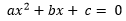
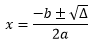

Java Bhaskara
====================

Example Application: bhaskara

> 

## Calculate Delta

> (c)")

```java
Double delta = 0.0;
delta = (Math.pow(b, 2)) - 4 * (a) * (c);
```

## Calculate X

> 


#### Calculate x'

>  )/(2 * a)")

```java
Double x1 = 0.0;
x1 = (((b) * -1) + Math.sqrt(delta) / (2 * a);
```

#### Calculate x''

>  )/(2 * a)")

```java
Double x2 = 0.0;
x2 = (((b) * -1) - Math.sqrt(delta) / (2 * a);
```

#### Check real roots

```java
if (Double.isNaN(x1)) {
	//TODO					
}
```

## Some links for more in depth learning

* [JAVA PRINT](https://github.com/fefong/java_print);
* [JAVA SWITCH CASE](https://github.com/fefong/java_switch);
* [JAVA IF/ELSE](https://github.com/fefong/java_ifElse);
* [JAVA ARITHMETIC](https://github.com/fefong/java_calculator);

* [JAVA](https://github.com/search?q=fefong%2Fjava)

